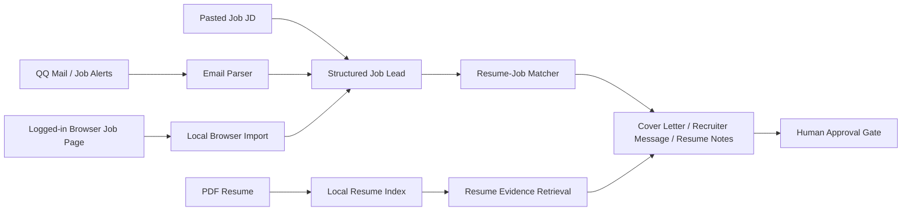

# AI Job Application Agent

面向中澳求职市场的双语 AI 求职申请助手。它可以读取求职邮件、自动读取公开岗位链接、从已登录的招聘网页导入岗位 JD，或让用户手动粘贴岗位信息；随后结合本地简历证据做匹配分析，并生成简历修改建议、求职信草稿和招聘方消息。所有对外动作都会停在人工确认前。

An AI-assisted, bilingual job application workflow for candidates applying across Australia and China-facing roles. It scans job emails, reads public job links, imports job text from logged-in browser pages, or accepts pasted job descriptions; then it matches roles against local resume evidence and prepares application drafts with a human approval gate.


## 目录

- [项目背景](#项目背景)
- [当前功能](#当前功能)
- [使用方法](#使用方法)
- [版本更新摘要](#版本更新摘要)
- [技术架构](#技术架构)
- [项目结构](#项目结构)
- [安全边界](#安全边界)

## 项目背景

这个项目不是“自动海投工具”，而是一个求职场景下的 Agent 工作流演示：

- 对澳洲岗位，重点是英文求职信、recruiter message、工作权利和岗位要求核对。
- 对国内 AI / 大模型岗位，重点是展示 Agent、tool use、RAG、邮件解析、简历证据检索和双语产品能力。
- 对用户体验，重点是让小白用户也能通过 Web UI 完成“上传简历 -> 选择岗位来源 -> 查看申请草稿”的流程。

The project is designed as a portfolio-ready AI agent system rather than a blind auto-apply bot. It demonstrates practical agent workflow design, resume-grounded retrieval, bilingual UX, local privacy handling, and safe human review.

## 当前功能

| 模块 | 说明 |
| --- | --- |
| 简历上传 | 在 Web UI 上传 PDF 简历，并生成本地简历证据索引。 |
| 邮件扫描 | 从 QQ 邮箱读取求职相关邮件，按日期范围筛选岗位线索。 |
| 岗位来源三模式 | 支持自动读取公开岗位链接、从已登录招聘网页导入岗位文本，也支持手动粘贴 LinkedIn、Seek、公司官网、Boss、猎聘等平台的岗位 JD。 |
| 简历匹配 | 将岗位要求和简历证据做匹配，显示匹配度、推荐原因和缺失关键词。 |
| RAG 检索 | 从简历索引中找出与岗位最相关的经历片段。 |
| 草稿生成 | 生成简历修改重点、求职信草稿和招聘方消息。 |
| 语言判断 | 中文界面不等于中文草稿；澳洲/英文岗位会生成英文求职信和英文消息。 |
| 人工确认 | 不自动发送邮件，不自动提交申请，所有外部动作都需要用户确认。 |
| 双语 Web UI | 支持中文和英文界面切换，面向中澳求职场景。 |

## 使用方法

### 1. 推荐：一键启动 Web UI

Windows 用户可以直接双击项目根目录里的：

```text
start-webui.bat
```

它会自动启动本地后端、前端，并打开：

```text
http://127.0.0.1:5173/
```

如果想在 PowerShell 里启动：

```powershell
.\start-webui.ps1
```

第一次换电脑或依赖缺失时，可以执行：

```powershell
.\start-webui.ps1 -Install
```

### 2. 手动启动后端

```powershell
python -m pip install -e .
python -m backend.app.api
```

后端默认运行在：

```text
http://127.0.0.1:8000
```

### 3. 手动启动前端

打开第二个 PowerShell：

```powershell
cd frontend
npm install
npm run dev
```

前端默认运行在：

```text
http://127.0.0.1:5173
```

### 4. 在 Web UI 里使用

1. 上传 PDF 简历。
2. 选择一种岗位来源：
   - 扫描 QQ 邮箱里的求职邮件。
   - 或在“岗位来源”里用自动模式读取岗位链接。
   - 如果网站需要登录，用“登录后导入”：系统会打开一个专用登录浏览器。你在里面登录一次，打开岗位详情页，再回 Web UI 点“读取当前页面并生成”。
   - 如果自动读取和登录后导入都不方便，再切换到手动模式粘贴 JD。
3. 点击生成或分析。
4. 在推荐职位里选择一个岗位，优先点击“读取岗位详情”。
5. 如果网站阻止自动读取，页面会自动跳到备用输入区；这时打开岗位网页，复制 JD 到描述框，再生成材料。
6. 查看职位匹配结果、简历证据、缺失关键词和申请草稿。
7. 人工确认后，再决定是否复制内容去投递或回复招聘方。

### 5. 命令行备用流程

```powershell
python -m backend.app.cli build-resume-index --resume-pdf "C:\path\to\resume.pdf"
python -m backend.app.cli run-agent --since 2026-05-08 --top 3
```

### 6. 运行测试

```powershell
python -m unittest discover -s tests
cd frontend
npm run build
```

## 版本更新摘要

完整更新记录见 [CHANGELOG.md](./CHANGELOG.md)。

| 日期 | 更新重点 |
| --- | --- |
| 2026-05-10 | 新增专用登录浏览器：自动读取岗位链接失败时，可以打开一个本地浏览器让用户登录，再读取当前岗位页并生成材料，不需要安装扩展。 |
| 2026-05-10 | 优化邮件扫描后的主流程：推荐职位详情页新增“读取岗位详情”，优先自动读取邮件里的岗位链接；失败时再引导用户打开原网页并粘贴 JD。 |
| 2026-05-10 | 重构“登录后导入”界面：改成三步操作卡片，明确提示“先拖到书签栏、再去岗位页点击、最后回本页读取”。 |
| 2026-05-10 | 新增 Windows 一键启动脚本：双击 `start-webui.bat` 或执行 `.\start-webui.ps1` 即可启动后端、前端并打开 Web UI。 |
| 2026-05-10 | 新增网页登录导入模式：用户在 LinkedIn、Seek、Boss、猎聘或公司官网登录后，用书签按钮把当前岗位导入本地助手，账号密码不进入本项目。 |
| 2026-05-10 | 岗位来源升级为自动/手动双模式：可以读取公开岗位链接，也可以粘贴非邮件来源 JD 并生成申请草稿。 |
| 2026-05-09 | 重构 Web UI，强化视觉引导；支持中文简历解析、中英文匹配、草稿语言判断和上传超时处理。 |
| 2026-05-08 | 搭建早期 Agent 原型：邮件解析、岗位匹配、简历证据检索、申请草稿和安全审批关卡。 |

## 技术架构



核心技术：

- Backend: Python, FastAPI, local file storage.
- Frontend: React, TypeScript, Vite.
- Logged-in page reading: Playwright persistent browser profile stored under `data/private/`.
- Resume parsing: PDF text extraction and local evidence indexing.
- Matching: rule-based resume-job scoring with cross-language keyword support.
- Agent workflow: input collection, structured parsing, retrieval, drafting, and human approval.

## 项目结构

```text
backend/
  app/
    api.py                 # FastAPI local API for the Web UI
    cli.py                 # Command-line workflows
    parsers/               # Job email parsing
    rag/                   # Resume evidence indexing and retrieval
    services/              # Matching, ingestion, drafting, agent workflow
data/
  sample_emails/           # Synthetic examples only
docs/
  architecture.md          # Architecture notes
frontend/
  src/App.tsx              # Bilingual React Web UI
tests/
```

## 安全边界

- 私有简历索引、邮件扫描结果和运行报告会写入 `data/private/`，该目录已被 `.gitignore` 忽略。
- 不提交 `.env`、邮箱授权码、API key、原始邮箱导出或私人简历结果。
- 当前系统只生成本地草稿，不会自动发邮件，也不会自动投递。
- 生成的求职信和招聘方消息必须人工核对，尤其要确认工作权利、地点、岗位资格和简历内容真实性。

## English Summary

This repository contains a local-first AI job application agent for China-Australia job search workflows. It supports resume PDF indexing, QQ Mail job-alert scanning, pasted job description analysis, resume-job matching, lightweight resume evidence retrieval, bilingual UI, draft generation, and a strict human approval gate.

The project is intended to demonstrate applied AI agent engineering: tool use, retrieval-augmented resume evidence, structured parsing, safe automation boundaries, and product thinking for real job search workflows.
