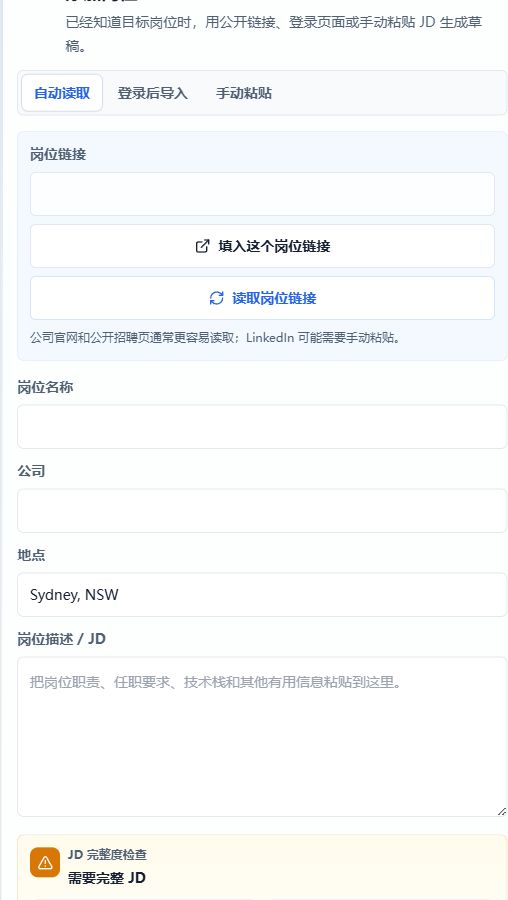
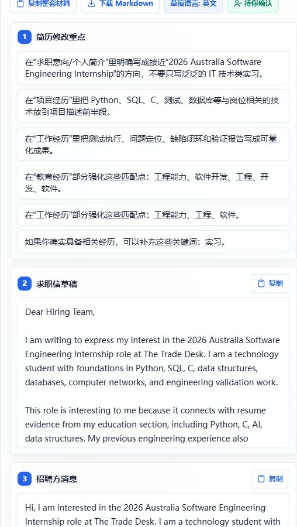
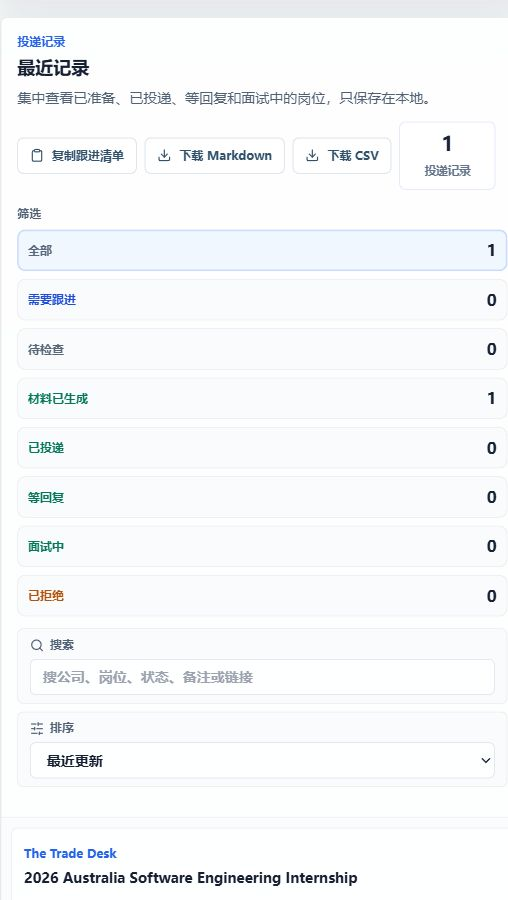

# Quick Start Tutorial / 快速上手教程

This tutorial walks through the fastest path from resume to reviewable application materials.

这份教程按真实使用顺序说明：从上传简历到生成可检查的申请材料。

## Before You Start / 开始前准备

**中文**

你需要准备：

- 一份 PDF 简历。
- QQ 邮箱授权码，前提是你要用邮箱扫描。
- 一个具体岗位 JD 或岗位链接，前提是你要用单个岗位模式。

**English**

Prepare:

- A PDF resume.
- A QQ Mail authorization code if you want mailbox scanning.
- A specific JD or job link if you want One Job mode.

## Step 1: Confirm The Dashboard / 第一步：确认工作台

**中文操作**

1. 打开 Web UI。
2. 确认左侧导航存在“开始、单个岗位、推荐职位、申请包、投递记录”。
3. 看顶部目标区。如果简历、岗位来源、草稿都显示完成，说明当前已有可检查结果。

**English steps**

1. Open the Web UI.
2. Confirm the left navigation shows Setup, One Job, Jobs, Drafts, and Applications.
3. Check the goal panel. If resume, job source, and drafts are complete, there is already a result to review.

## Step 2: Upload Or Replace Resume / 第二步：上传或更换简历

**中文操作**

1. 进入“开始”。
2. 点击“选择简历 PDF”或“更换简历 PDF”。
3. 等页面显示“简历已准备好”。
4. 检查系统识别出的关键词是否基本符合你的简历方向。

**English steps**

1. Go to Setup.
2. Click Choose resume PDF or Replace resume PDF.
3. Wait until the UI says the resume is ready.
4. Check whether the extracted keywords roughly match your profile.

**常见问题 / Common issue**

- 如果一直显示上传中，先刷新页面，再重新上传 PDF。
- If the upload stays stuck, refresh the page and upload the PDF again.

## Step 3A: Scan Mail For Jobs / 第三步 A：扫描邮箱找岗位

**中文操作**

1. 在“读取邮件日期”里选择范围。
2. 设置“准备几份草稿”。
3. 点击“扫描邮件、读取链接并生成草稿”。
4. 等系统读取邮件、解析岗位、尝试读取岗位链接。

适合场景：你收到了 LinkedIn、Seek、UNSW Connect、公司招聘系统等邮件提醒，希望系统先帮你筛选。

**English steps**

1. Choose a mail date range.
2. Set how many drafts to prepare.
3. Click the scan button.
4. Wait while the system reads mail, extracts leads, and tries to read job links.

Best for: LinkedIn, Seek, UNSW Connect, and company recruitment email alerts.

## Step 3B: Use One Job Mode / 第三步 B：处理单个岗位

**中文操作**

1. 进入“单个岗位”。
2. 如果是公开岗位链接，先尝试“自动读取”。
3. 如果网站需要登录，用“登录浏览器导入”。
4. 如果读取结果不完整，切到“手动粘贴”，把完整 JD 粘贴进去。
5. 点击生成申请材料。

**English steps**

1. Go to One Job.
2. Try Auto Read for public job links.
3. Use logged-in browser import if the site requires login.
4. If the result is incomplete, switch to Manual Paste and paste the full JD.
5. Generate application materials.

**判断标准 / How to judge quality**

- 好的 JD：包含职责、要求、技术栈、地点、公司和申请方式。
- 不好的 JD：只有岗位列表、推荐职位、搜索结果或很多无关导航文字。
- Good JD: responsibilities, requirements, tech stack, location, company, and application details.
- Bad JD: job lists, recommendations, search results, or mostly navigation text.

## Step 4: Review Recommended Jobs / 第四步：查看推荐岗位

**中文操作**

1. 进入“推荐职位”。
2. 先看匹配度和推荐原因。
3. 再看“可补关键词”。
4. 如果关键词经常出现，优先把它补成真实项目或简历 bullet point。

**English steps**

1. Go to Jobs.
2. Review match level and recommendation reason.
3. Check keyword gaps.
4. If a keyword appears repeatedly, turn it into a real project feature or resume bullet.

## Step 5: Review Drafts / 第五步：检查申请包

**中文操作**

1. 进入“申请包”。
2. 先检查简历修改重点。
3. 再检查求职信草稿。
4. 最后检查招聘方消息。
5. 确认无误后再复制到邮件、LinkedIn 或招聘平台。

**English steps**

1. Go to Drafts.
2. Review resume edit notes first.
3. Review the cover letter draft.
4. Review the recruiter message.
5. Copy only after manual review.

## Step 6: Track Applications / 第六步：记录投递状态

**中文操作**

1. 进入“投递记录”。
2. 检查每个岗位的公司、岗位名和状态。
3. 投递后改成“已投递”。
4. 如果需要跟进，设置备注或下一步动作。

**English steps**

1. Go to Applications.
2. Check company, role, and status.
3. After applying, mark it as Applied.
4. Add notes or next action if follow-up is needed.

## Manual Browser Test Notes / 手动浏览器测试记录

**中文**

本教程截图来自一次本地浏览器手动测试。测试内容包括：

- 页面加载无 Vite 报错层。
- 控制台无 error / warning。
- 中英文切换正常。
- 左侧导航可以跳转到开始、单个岗位、推荐职位、申请包和投递记录。
- 页面高度大于视窗高度，浏览器可滚动。

**English**

The screenshots in this tutorial were captured during a local browser manual test. The test covered:

- No Vite error overlay.
- No console errors or warnings.
- Chinese/English language toggle works.
- Left navigation opens Setup, One Job, Jobs, Drafts, and Applications.
- Page height is larger than the viewport and scrolling is available.

