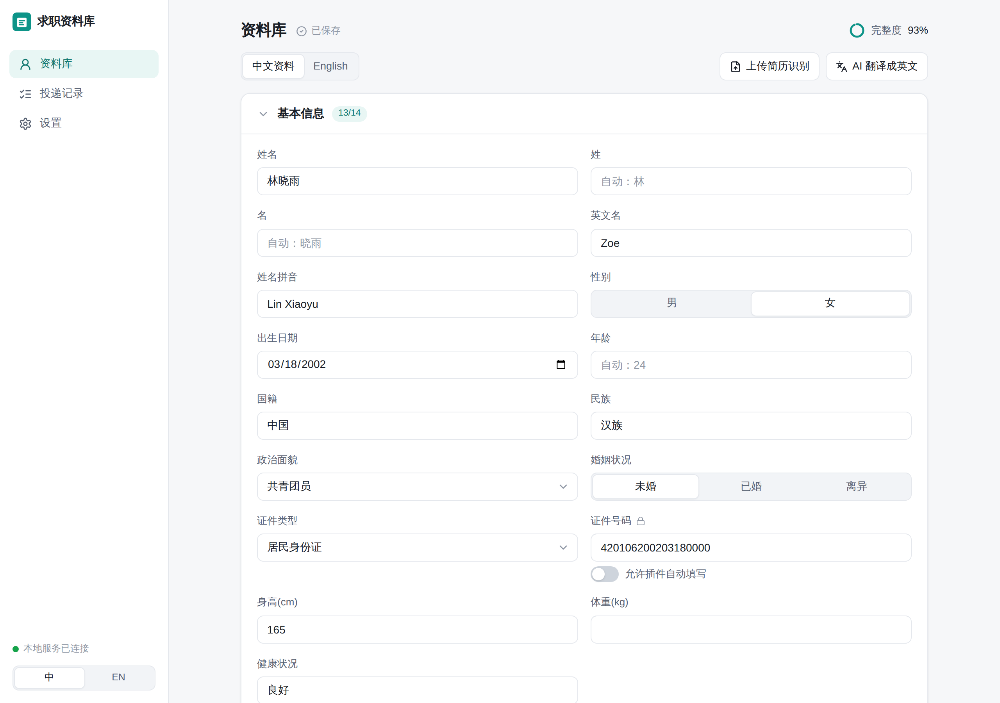
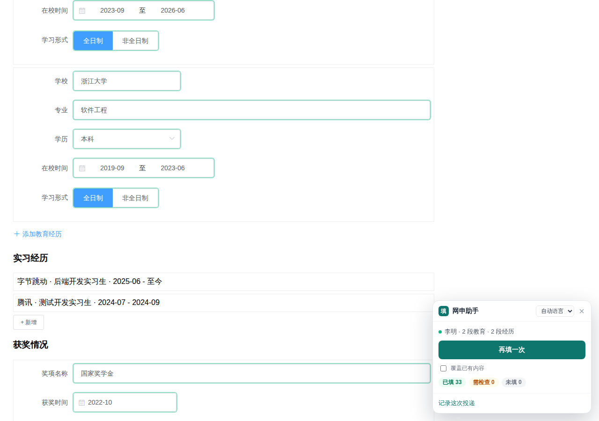
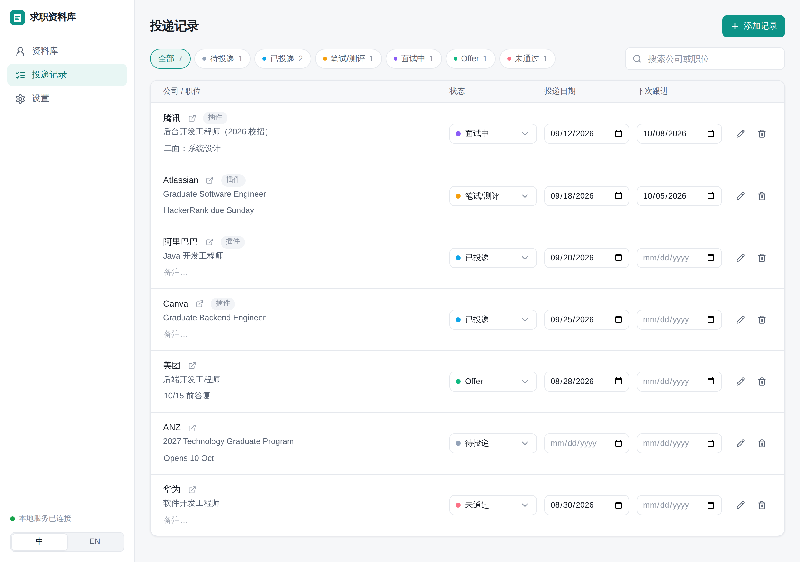
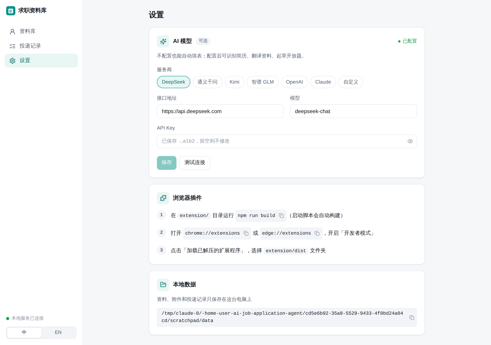

# 使用手册 / User Manual

## 1. 准备资料库

打开 `http://127.0.0.1:5173`（`start-webui.bat` 会自动打开）。

- **上传简历识别**：选择简历 PDF，识别结果会先给你确认，再合并进资料库（只填空着的栏位，不覆盖你改过的内容）。没配置 AI 时用规则识别姓名、电话、邮箱、性别、政治面貌、教育经历等；配置 AI 后能识别全部内容。
- **中文资料 / English**：同一份资料有中英两个版本。国内网申用中文版，澳洲网申用英文版。英文版空着时会用中文版补，面板会标记「用了另一种语言的资料」。配置 AI 后可以一键翻译。
- **多段经历**：教育、实习/工作、项目、校园经历、获奖、语言、证书、家庭成员都可以加多条。实习经历请选择「类型：实习」，有的网申把「实习经历」和「工作经历」分开填。
- **结束时间「至今」**：勾选后，网申页面上会自动勾「至今 / I currently work here」。
- **地区**：用 `/` 分隔，例如 `广东省/深圳市/南山区`，插件会逐级点省市区级联选择器；没有斜杠的输入框会填 `广东省深圳市南山区`。
- **常用问答**：网申里反复出现、但不属于简历的问题（期望薪资、到岗时间、从哪里得知招聘信息……）。插件也会把你手写的答案加进来。
  - 点 **常见问题**，从 24 个中英文常见网申问题里勾选（自我介绍、职业规划、为什么选择我们、优缺点、最有成就感的事、团队合作、期望薪资……），一键加入。
  - 配置 AI 后，每题旁边有 **AI 起草**，也可以点 **AI 起草全部空白回答**，根据你的资料批量写好，你再改。写好的回答在各网站遇到同样的问题时自动填入。
- **身份证号**：填了身份证号、但没填出生日期或性别时，插件会从身份证号推出来（身份证号本身默认不自动填）。
- **附件**：中文简历、英文简历、证件照、成绩单、求职信。遇到上传框时插件自动选中对应文件（中文页面用中文简历，英文页面用英文简历）。
- **证件号码**默认不自动填写；需要时在字段下方打开「允许插件自动填写」。

资料会自动保存（右上角显示「已保存」）。

## 2. 安装插件

1. 运行一次 `start-webui.bat`，它会把插件构建到 `extension\dist`。
2. Chrome 打开 `chrome://extensions`，或 Edge 打开 `edge://extensions`。
3. 打开右上角「开发者模式」→ 点「加载已解压的扩展程序」→ 选择 `extension\dist`。
4. 点浏览器工具栏的插件图标，显示「已连接」就好了。

本地服务没启动时，插件会用最近一次缓存的资料继续填写（附件上传需要本地服务）。

## 3. 在网申页面一键填写

1. 打开网申页面，右下角出现「填」按钮（也可以点工具栏图标，或按 `Alt+Shift+F`）。
2. 点「一键填写本页」。插件会：
   - 填好能识别的所有栏位，页面上绿色框是已填，黄色框是请你检查，红色框是没填成功；
   - 在教育、实习等板块点「添加」，补足你资料里的条数（弹窗式表单会自动填好并点「确定」）；
   - 跳过已经有内容的栏位（勾「覆盖已有内容」可以重新填）。
3. 看面板里的清单：
   - **需要你检查**：点一下跳到那个栏位。比如下拉框里没有完全一样的选项、需要选到区县、字数超限被截断。
   - **开放题**：配置 AI 后点「AI 起草」；也可以自己写，写完面板会出现「记住我填的 N 条答案」。
   - **没识别的栏位**：在右边下拉里选对应的资料字段，立即填入，**这个网站下次自动识别**；选「本站跳过此栏」则以后不再提示。配置 AI 后可以点「AI 识别剩余栏位」。
   - **资料库里缺少**：页面要的信息你还没填，回资料库补上即可。
4. 多页网申（基本信息 → 教育 → 下一步）：每一页都点一次填写。
5. 检查无误后**你自己点提交**。点提交按钮后面板会提示「记一笔投递」，确认公司和岗位后点「记录投递」。

### 简历是只读展示页（比如工行校招简历）

有的网站把你已经填过的内容显示成卡片，页面上没有输入框。这时面板会提示「展示模式」，点 **帮我点「编辑」并填写**，插件会打开当前屏幕里的编辑表单再填写；或者你自己点「编辑 / 添加」后再点一键填写。

### 开放题和字数限制

- 开放题会列在面板的「开放题」里。一页有多个时可以点 **AI 全部起草**。
- 起草会遵守栏位的字数限制（网页的 maxlength，或者题目里写的「不超过 300 字」）。
- 资料太长、超过栏位字数时，插件会在最后一个句号或逗号处截断，不会断在半句话中间，并标黄提醒你检查。

### 支持的情况

- 国聘、应届生求职网、51job，以及公司自建网申（北森、Moka、飞书招聘、大易等）常用的 Element UI / Element Plus / Ant Design / Layui 组件。
- 多选下拉（意向岗位）和多选框组（意向城市）：资料里用「、」分隔多个值，比如 `北京、深圳`。
- 省/市/区分成几个下拉框时，按资料里的 `省/市/区` 逐级选；资料里少一级（比如没写区县）会提示你补。
- 下拉框里没有你的学校、证书等时，会选「其他」并提示你补充填写。
- 澳洲：Workday 风格（月/年分开的日期、"I currently work here"、工作权利 yes/no 问题）、Greenhouse / Lever 这类普通表单、Seek 的附加问题。
- 嵌在 iframe 里的网申表单。

### 填不好怎么办

- 某个栏位总认错：在面板里手动选一次，本网站以后都会记住。
- 某个下拉框打不开或选不中：面板里会列出它的可选项，手动选一下即可。
- 想让插件彻底适配某个网站：在那个网申页面打开面板，点底部「导出页面结构（用于适配新网站）」，会下载一个 `form-structure-网站名.json`。里面只有栏位名称、组件类型和下拉选项，**不包含你填写的任何内容**。把它发给开发者，就能照着做一个测试页把这个网站调好。

## 4. 投递记录

插件记录的投递和你手动添加的都在这里。可以按状态筛选、搜索、改状态（待投递 / 已投递 / 笔试测评 / 面试中 / Offer / 未通过）、设置下次跟进日期和备注。

## 5. 设置

- **AI 模型（可选）**：选预设（DeepSeek、通义千问、Kimi、智谱 GLM、OpenAI、Claude）或自定义 OpenAI 兼容接口，填 API Key，点「测试连接」。
- **浏览器插件**：安装步骤和插件文件夹位置。
- **数据位置**：所有资料保存在本机 `data/private/`。

---

## English quick guide

1. Run `start-webui.bat` (first time: `.\start-webui.ps1 -Install`). It starts the local API (`:8000`), opens the profile UI (`:5173`) and builds the extension into `extension\dist`.
2. Load the extension: `chrome://extensions` → Developer mode → Load unpacked → `extension\dist`.
3. Fill your profile (upload your resume PDF to prefill it). Keep a Chinese and an English version; the extension picks one by page language.
4. On an application form, click the floating button (or press `Alt+Shift+F`) → **一键填写本页 / Fill this page**. Review the yellow/red fields listed in the panel, answer open questions (optionally with AI), map unrecognized fields once per site, then submit yourself and record the application.
