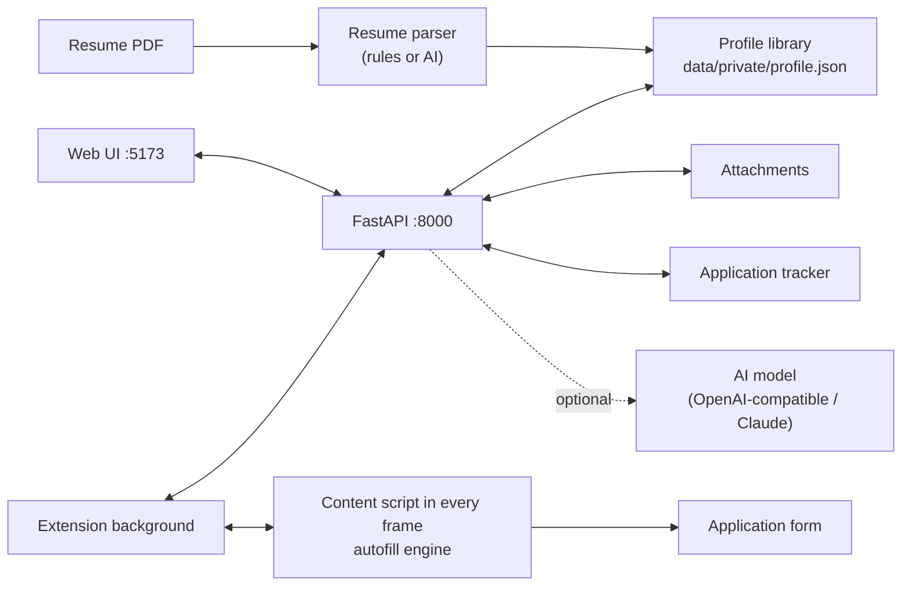

# Architecture

## Shared profile schema

`shared/profile-schema.json` is the single source of truth, read by all three parts:

- `basicGroups`: single-value fields (identity, contact, China-specific, overseas, preferences, summary).
- `sections`: repeatable lists (education, work, projects, campus, awards, languages, certificates, family). Each section has `headings` (section titles as they appear on forms) and fields.
- Every field has `match` (label synonyms in Chinese and English), optional `exact` (labels that only match exactly, e.g. `姓`, `名`) and `not` (words that disqualify, e.g. `紧急` for the phone field).
- `enums`: canonical values (`bachelor`, `league_member`, …) with option synonyms, so `本科`, `大学本科`, `学士`, `Bachelor's Degree` all select the same thing.

Profile values are plain strings for language-neutral fields (dates, email, enum values) and `{zh, en}` objects for localized ones.

## Autofill engine (`extension/src/engine`)

One fill runs per frame:

1. **discover.ts** — finds controls and treats library widgets as one control: cascaders, date pickers, custom selects (Element, Ant Design, iView, Arco, TDesign, Layui, select2, chosen, ARIA comboboxes), radio groups, checkboxes, file inputs (including hidden ones behind upload widgets), text inputs and textareas.
2. **label.ts** — label text from `aria-labelledby`, `<label for>`, wrapping labels, library form-item labels, fieldset legends, table cells and preceding text; plus placeholder and name/id hints.
3. **sections.ts** — finds section headings ("教育经历", "Work Experience") in document order and ignores navigation/stepper clusters, so each control knows which section it is in. Separate 实习经历 / 工作经历 headings split work entries by type.
4. **classify.ts** — scores every schema field against the label (exact > contains > partial), adjusted by control type and section context; falls back to placeholder, identifiers, `autocomplete`, the saved-answers library and per-site memory.
5. **engine.ts (plan)** — pairs two date widgets under one label into start/end, detects month/year part inputs, and numbers entries in repeatable sections (a repeated field starts the next entry).
6. **fillers.ts / dropdown.ts** — fills each control the way a user would so React/Vue/Angular bindings update: native value setter + input/change events; pointer sequences to open dropdowns; typing into search boxes (remote search); scrolling virtual lists; clicking cascader levels (with pass-through for `市辖区`); typing dates in the format the widget expects and verifying they stuck; ticking 「至今」; uploading files through `DataTransfer`.
7. **repeat.ts** — adds missing entries: finds the section's Add button, then either fills the new inline block (and clicks its save button if it has one) or fills the dialog that opened and clicks 确定/保存. Entries already shown on the page as saved cards are skipped.

8. **capture.ts** — the reverse direction: reads what each control currently shows (selected option text, cascader path, date parts, 至今 toggles), converts it to the stored format (enum values, `YYYY-MM` dates, `省/市/区` regions), groups section values into entries and diffs them against the profile. Entries are matched by their main field (school, company, …) and start date; unmatched ones become new entries. New values are proposed ticked, conflicting ones unticked; `POST /api/profile/capture` writes the ticked ones.

The engine never clicks submit and never ticks agreement checkboxes.

## Extension shell

- **background.ts** — talks to the local API (with an offline cache of the profile), fetches attachments, sends fill commands to every frame via `webNavigation.getAllFrames`, stores per-site field mappings, records applications.
- **content/frame.ts** — runs the engine in its frame, highlights results, watches unfilled fields for user-typed answers, detects submit clicks, and on trusted 保存 / 下一步 / 提交 / 确定 clicks captures the frame (or the dialog the button is in) before the page changes. Pending proposals are kept per tab in `chrome.storage.session` so they survive navigation.
- **content/panel.ts** — the review panel (top frame only, in a shadow root).

## Tests

- `tests/` — backend API, profile store, AI task plumbing (mocked models), tracker.
- `extension/test/*.test.mjs` — fixture pages built with the real component libraries (Element UI, Element Plus, Ant Design, Layui, native HTML, Workday-style) filled by the engine in headless Chromium; `e2e.test.mjs` loads the built extension against a running backend, including an iframe-hosted form, attachment upload, answer learning and per-site mapping memory.
